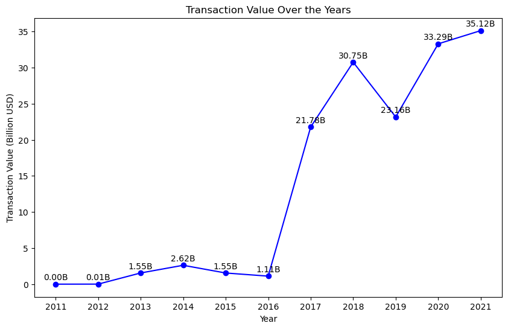
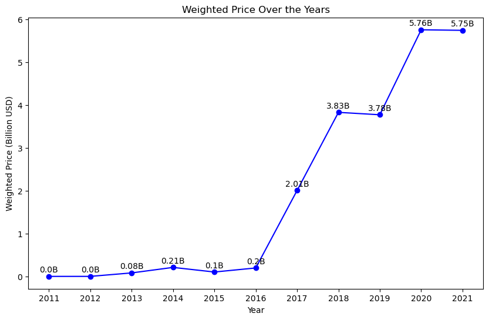
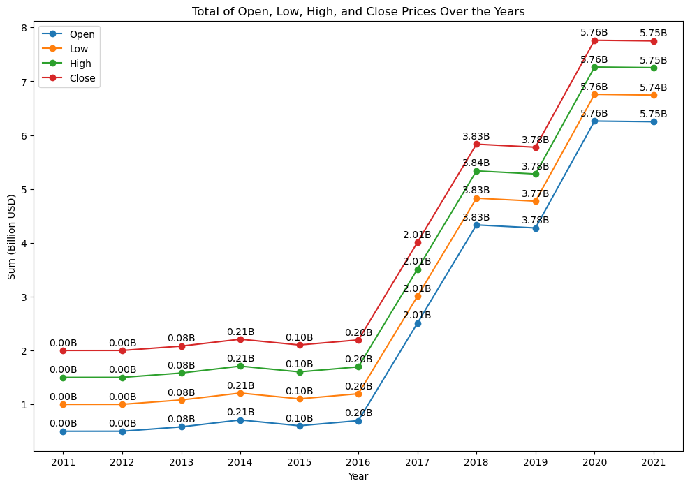
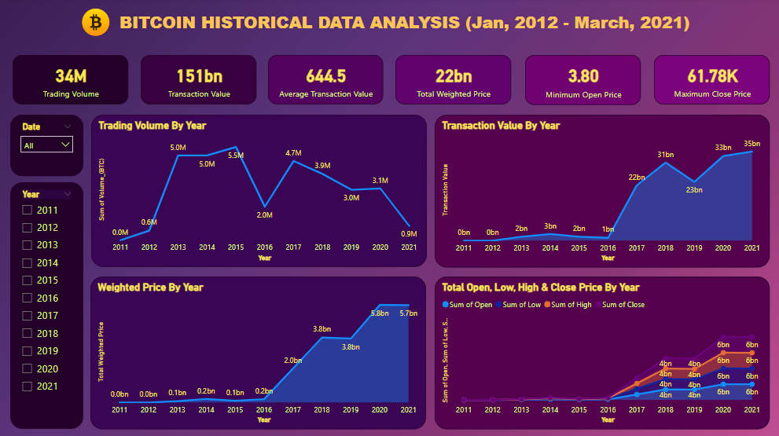

# Bitcoin Historical Data (Jan, 2012 - March, 2021) Analysis

 

## Table of Contents
- [Project Overview](#project-overview)
- [Tools Used](#tools-used)
- [Dataset Overview](#dataset-overview)
- [Bitcoin Historical Data EDA In Python](#bitcoin-historical-data-eda-in-python)
- [View Power BI Dashboard Report](#view-power-bi-dashboard-report)
 

## Project Overview
### Introduction:

Over the past decade, a lot of attention and investment have been focused on Bitcoin, the pioneering cryptocurrency. Knowing its price movements and trading volumes in terms of historical performances thus becomes very instrumental for investors, traders, and researchers. This data analysis project is purposed to help understand the trends, patterns, and insights that can be obtained with regard to the historical data of Bitcoin from 2012 to 2021, informing investment decisions and giving an overview of the market.
  
### Problem Statement
- What was the trading volume of Bitcoin between 2012 - 2021?
- What was the transaction value within this period?
- What was the average transaction value within this period?
- What was the total weighted price of Bitcoin within this period?
- What was the minimum open price and maximum close price within this period?
- Explain all these with charts showing their trends over the years.
- Any other relevant data driven insights from the analysis

### Objectives:
- __Analyze Bitcoin Trading Volume in 2012-2021:__ The trading volume of Bitcoin from the years 2012 to 2021 trends to educate on the degree of activity and liquidity in the market at different points in time.
- __Ascertain Value Transacted on Bitcoin Network in 2012-2021:__ Calculate the aggregate transaction value of Bitcoin in the given period to know the monetary value of transactions executed on the Bitcoin network.
- __Average Transaction Value:__ The average transaction value of Bitcoin transactions may be calculated over the period under consideration to derive what could be estimated as a typical size of the transaction.
- __Total Weighted Price:__ The total weighted price of Bitcoin has to be assessed in the period to understand its general trend in price and to arrive at a sense of the market's valuation for Bitcoin.
- __Identify Price Extremes__: Provide the minimum open price and maximum close price of Bitcoin within the period, pointing out a range in which price fluctuations/extremes were viewed in the market.
__Trends Charted__: Illustrate via visualizations Bitcoin trading volume, value of transactions, average transaction value, weighted price, minimum open price, maximum close price, open, low, high, and close price over the years with line charts.
- __Inform with Data-Driven Insight__: Draw out from the analysis beyond the explicitly posed questions, showing striking trends, outliers, or relationships observed in the data set and what that may tell the decision-makers in terms of deeper insights about the market dynamics of Bitcoin.
 
 

### Skills Utilized
1. Data Cleaning
2. Data Visualiziation
3. Descriptive Analytics
4. Critical Thinking and Problem Solving
5. Communication and Reporting
 

### Tools Used
1. Python (Was used for Data Cleaning, profilling and Exploratory Data Analysis)
   - The following Python Features were incorporated:
      1. Jupiter Notebook
      2. Numpy
      3. pandas
      4. Visualization
          - Matplotlib
          - Seaborn
          - Plotly
      5. Integration With Other tools
  
3. Power BI (Was used to create reports and dashboard for this analysis)
   - The following Power BI Features were incorporated:
      1. Bookmarking
      2. DAX
      3. Quick Measures
      4. Modelling
      5. Filters
      6. Tooltips
 
 

### Methodology (Python):
- __Data Collection:__ Gather Bitcoin historical data covering the period from 2012 to 2021, ensuring data integrity and accuracy.
  
- __Data Preprocessing:__
    1. Remove data rows with null values or has __"NaN"__ because we have __1,243,608__ rows of data with only Timestamp column data and without the rest of the column data.
    2. Create a datetime column from the Timestamp column and name it __"Date"__.
    3. Create a __"Year"__ column from the __"Date"__ column.
    4. Remove the __"Timestamp"__ column.
    5. Re-arrange the columns properly using Excel's __Power Query Editor__.     

- __Exploratory Data Analysis (EDA):__ Conduct EDA to gain insights into Bitcoin price dynamics, trading volume patterns, and overall market behavior. Visualize trends using line charts, and other charts.
 

### Statistical Analysis:
- Calculate descriptive statistics, including mean, median, standard deviation, and correlation coefficients, to quantify Bitcoin's price movements and trading activity.
 

### Volatility Analysis:
- Measure Bitcoin's volatility using standard deviation, historical volatility, or other volatility metrics. Explore the implications of volatility on risk management and investment strategies.
 
 

### Dataset Overview
The primary dataset used in this analysis was provided by [Quantum Analytics](https://www.quantumanalyticsco.org/). I couldn't upload it to github because of its large size. It came with 4,857,377 rows of data and has a size of almost 300 megabyte. You can also download this dataset [here](https://www.kaggle.com/datasets/mczielinski/bitcoin-historical-data). This dataset is made up of CSV files for select bitcoin exchanges for the time period of Jan 2012 to December March 2021, with a minute to minute updates of OHLC (Open, High, Low, Close), Volume in BTC and indicated currency, and weighted bitcoin price. Timestamps are in Unix time. Timestamps without any trades or activity have their data fields filled with NaNs. If a timestamp is missing, or if there are jumps, this may be because the exchange (or its API) was down, the exchange (or its API) did not exist, or some other unforeseen technical error in data reporting or gathering. All effort has been made to reduplicate entries and verify the contents are correct and complete to the best of my ability, but obviously trust at your own risk. It is worth noting that there are 4,857,377 rows and 8 columns present in the Bitcoin Historical data.

The dataset contains 1 sheet/table and below is a table that describes all the fields in all the tables in this dataset.

| Table                              | Field                    | Description                            |            
|:-----------------------------------|:------------------------ |:-------------------------------------- |
|Bitcoin Historical Dataion Chart    | Timestamp                | This column represents the timestamp or time at which the data point was recorded. It is a reference to a specific moment in time, often in Unix timestamp format (measured in seconds since January 1, 1970).    |
|                                    | Open                     | The opening price of the financial instrument (e.g., a cryptocurrency) during the specified time period. It is the price at which the first trade occurred.     |
|                                    | High                     | The highest price reached during the specified time period.         |
|                                    | Low                      | The lowest price reached during the specified time period.         |
|                                    | Close                    | The closing price of the financial instrument at the end of the specified time period. It is the price at which the last trade occurred.        |
|                                    | Volume (BTC)             | The total trading volume of the financial instrument in terms of the base currency (e.g., Bitcoin) during the specified time period. It represents the total quantity of the financial instrument traded.        |
|                                    | Volume (Currency)        | The total trading volume of the financial instrument in terms of the quote currency (e.g., US dollars) during the specified time period. It represents the total value of the trades.        |
|                                    | Weighted Price           |  The volume-weighted average price (VWAP) or the average price of the financial instrument during the specified time period, considering the trading volume. It provides a more comprehensive view of the average transaction price.        |
 

## Bitcoin Historical Data EDA In Python:

__Trading Volume By Year__                | __Transactrion Value By Year__        
:----------------------------------------:|:--------------------------------:|
    |

 __Weighted Price By Year__                           |__Total Open, Low, High, Close Price By Year__ 
:----------------------------------------------------:|:----------------------------------------:|
          |  

 To view the complete Exploratory Data Analysis (EDA) of this project in python Jupiter Notebook, please click [here](BITCOIN_HISTORICAL_DATA.ipynb)
 
 
 
## Data Analysis and Visuals in Power BI:

1. From the dashboard, it was observed that the total Trading Volume between 2012 and 2021 is __34M BTC__.
2. The Total Transaction Value within this period is __151bn__, the Average Transaction Value is __644.5__.
3. Total Weighted Price within this period is 22bn, the Minimum Open Price is __3.80__, while the maximum is __61.78k__.
4. The Trading Volume by Year experienced its peak period in 2015 capping at __5.53M BTC__, while the year with the least volume traded was __567,948 BTC__.
5. 2012 was the year with the least transaction value with a value of __5.8M__ suggesting the nascent stage for Bitcoin as a financial asset whi it peaked in 2021 at __35.12bn__ reinforcing the ongoing prominence of Bitcoin in the financial market.
6. The year 2011 was not fully included in this analysis because the traded period was just for __3 months__ and wasn't well structured at that time.
7. A complete document in __PDF__ containing the observations and summary from this analysis can be viewed [here](A_Complete_Observation_and_Summary_Analysis_of_Bitcoin_Historical_Data.pdf)
 
 

## View Power BI Dashboard Report
Here’s a link to a [Dashboard Report](https://app.powerbi.com/view?r=eyJrIjoiYTczNTZlNzgtYzJiYS00OWZlLThiNTEtNTMxMzk2ZGM5ZjNkIiwidCI6IjdlYzI5NjU5LTNjZjItNGYzZi1hYmIzLWE3MjJlZGY3ZmYyZCJ9)
 I created in the second phase of this project . This dashboard report displays a vivid visual of this analysis on Historical Bitcoin trading trend between Jan, 2012 - March, 2021.
 
 

## Thank You For Following Through!

